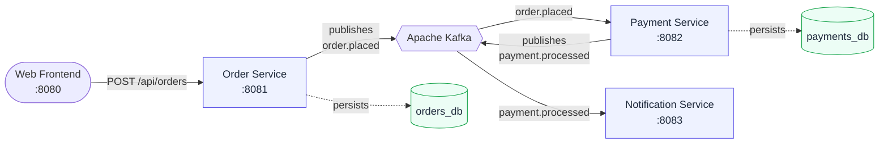

# 🛒 Event-Driven Order Processing System

> A distributed microservices system that processes orders through an asynchronous,
> Kafka-driven pipeline — ordering, payment, and notifications, each as its own
> independently deployable Spring Boot service.


---

## Overview

When a customer places an order, three loosely-coupled services react in turn — they
never call each other directly, they only communicate through **Apache Kafka events**.
This makes the system resilient: any service can be down or slow without blocking the
others, and failed payments are automatically retried and ultimately parked in a
dead-letter queue for inspection.

A small web frontend lets you place orders and watch them travel through the pipeline
in real time.

## Architecture



| Service | Port | Responsibility |
| --- | --- | --- |
| **Order Service** | 8081 | Accepts & validates order requests, persists them, publishes `order.placed`. Rejects duplicates via an idempotency key. |
| **Payment Service** | 8082 | Consumes `order.placed`, processes payment, publishes `payment.processed`. Non-blocking retries + dead-letter queue on failure. |
| **Notification Service** | 8083 | Consumes `payment.processed`, dispatches a confirmation or failure notice (logged in this demo). |

## Features

- **Event-driven & decoupled** — services integrate only through Kafka topics.
- **Idempotency** — duplicate order requests (same `idempotencyKey`) are detected and ignored end-to-end.
- **Resilient payments** — `@RetryableTopic` retries transient failures on suffixed retry topics, then routes to a `.DLQ` topic.
- **Input validation** — order requests are validated (email format, positive amount, required fields) with clean JSON error responses.
- **Database per service** — Order and Payment services each own a PostgreSQL database.
- **Observability** — Micrometer metrics scraped by Prometheus and visualised in Grafana.
- **Live frontend** — a responsive web console to place orders and watch the pipeline.
- **One-command startup** — the whole stack runs via Docker Compose with health-gated boot ordering.

## Tech Stack

| Layer | Technology |
| --- | --- |
| Language / Runtime | Java 21 |
| Framework | Spring Boot 4.0.5 (Spring Framework 7, Jackson 3) |
| Messaging | Apache Kafka (Spring for Apache Kafka 4.x) |
| Persistence | PostgreSQL 15, Spring Data JPA |
| Observability | Micrometer, Prometheus, Grafana |
| Frontend | Static HTML/CSS/JS served by nginx (reverse-proxies the API) |
| Infrastructure | Docker, Docker Compose |

## Project Structure

```
order-processing-system/
├── order-service/          # REST API + Kafka producer (:8081)
├── payment-service/        # Kafka consumer + producer, retry/DLQ (:8082)
├── notification-service/   # Kafka consumer (:8083)
├── frontend/               # nginx + single-page test console (:8080)
├── infrastructure/
│   ├── docker-compose.yml  # the whole stack
│   └── prometheus.yml      # scrape config
├── README.md
├── CHANGES.md              # what was fixed/improved vs. the original
└── LICENSE
```

## Prerequisites

- **Docker** + the **Docker Compose** plugin. That's all — Java and Maven run *inside*
  the build containers, so you don't need them installed locally.

```bash
docker --version
docker compose version
```

## Quick Start

```bash
# from the project root
cd infrastructure
docker compose up --build -d
```

This builds the three service images and starts everything in dependency order — the
application services wait for Kafka and PostgreSQL to report **healthy** before booting.
The first build downloads dependencies and may take a few minutes.

Check that everything is up:

```bash
docker compose ps
```

Tear everything down (including database volumes):

```bash
docker compose down -v
```

## Using the App

### Option A — the web frontend

Open **http://localhost:8080**

1. Click **Success example**, then **Place order** — watch the pipeline light up
   `Order → Payment (SUCCESS) → Notification`.
2. Click **Decline example**, then **Place order** — this triggers the retry / DLQ path
   (`Payment → DECLINED`).

> **Payment simulation:** amounts evenly divisible by **10** are declined; everything
> else succeeds. This lets you exercise both paths deterministically.

### Option B — the API directly

```bash
# place an order (succeeds)
curl -X POST http://localhost:8081/api/orders \
  -H "Content-Type: application/json" \
  -d '{
    "customerEmail": "test@example.com",
    "productName": "MacBook Pro",
    "amount": 150001,
    "idempotencyKey": "key-001"
  }'

# list processed payments
curl http://localhost:8082/api/payments

# look up the payment for a specific order
curl http://localhost:8082/api/payments/{orderId}
```

Watch the event flow across all three services:

```bash
docker compose logs -f order-service payment-service notification-service
```

## API Reference

| Method | Endpoint | Service | Description |
| --- | --- | --- | --- |
| `POST` | `/api/orders` | order (8081) | Place an order. Returns `201` with `orderId` and `status`. |
| `GET` | `/api/payments` | payment (8082) | List all payment records. |
| `GET` | `/api/payments/{orderId}` | payment (8082) | Get the payment for an order (`404` until processed). |

**`POST /api/orders` body**

| Field | Type | Rules |
| --- | --- | --- |
| `customerEmail` | string | required, valid email |
| `productName` | string | required |
| `amount` | number | required, greater than 0 |
| `idempotencyKey` | string | required, unique per order |

Invalid input returns `400` with details:

```json
{
  "status": 400,
  "error": "Bad Request",
  "message": "Validation failed",
  "details": { "customerEmail": "customerEmail must be a valid email address" }
}
```

## Event Flow & Topics

| Topic | Produced by | Consumed by |
| --- | --- | --- |
| `order.placed` | order-service | payment-service |
| `payment.processed` | payment-service | notification-service |
| `order.placed-retry-*` | payment-service (auto) | payment-service (retries) |
| `order.placed-dlt` / `.DLQ` | payment-service (auto) | dead-letter inspection |

Events are serialized as JSON (Jackson 3) and keyed by `idempotencyKey` so related
records land on the same partition.

## Observability

| Tool | URL | Notes |
| --- | --- | --- |
| Health | `http://localhost:8081/actuator/health` (and `:8082`, `:8083`) | Spring Boot Actuator |
| Prometheus | `http://localhost:9091` | Status → Targets shows all three services |
| Grafana | `http://localhost:3000` | login `admin` / `admin` |

To visualise metrics in Grafana, add a Prometheus data source pointing at
`http://prometheus:9090`, then build dashboards from the scraped Micrometer metrics.

## Ports

| Component | Host Port |
| --- | --- |
| Frontend | 8080 |
| Order Service | 8081 |
| Payment Service | 8082 |
| Notification Service | 8083 |
| Kafka | 9092 |
| orders-db / payments-db | 5434 / 5435 |
| Prometheus | 9091 |
| Grafana | 3000 |

## Running a Single Service Locally

Start just the infrastructure, then run a service from your IDE or Maven:

```bash
cd infrastructure && docker compose up -d kafka zookeeper orders-db payments-db
cd ../order-service && ./mvnw spring-boot:run
```

## Troubleshooting

<details>
<summary><b>Build fails with “Temporary failure in name resolution” / “Unknown host repo.maven.apache.org”</b></summary>

The Docker build can't reach Maven Central (DNS). Confirm the host has internet
(`curl -I https://repo.maven.apache.org/maven2/`). On Linux, if containers can't resolve
DNS, add public DNS to `/etc/docker/daemon.json` (`{ "dns": ["8.8.8.8", "1.1.1.1"] }`)
and restart Docker.
</details>

<details>
<summary><b>Kafka exits with <code>NodeExistsException</code> / fails to start</b></summary>

Leftover ZooKeeper state from a previous run. Reset cleanly:

```bash
docker compose down -v --remove-orphans
docker compose up -d
```
</details>

<details>
<summary><b>Frontend shows “offline” or an order stalls</b></summary>

Give the services ~30s to finish booting (the console auto-retries). Verify
`docker compose ps` shows `order-service` and `payment-service` as **healthy**, and
check `docker compose logs payment-service` for errors.
</details>

## License

Released under the [MIT License](LICENSE).
